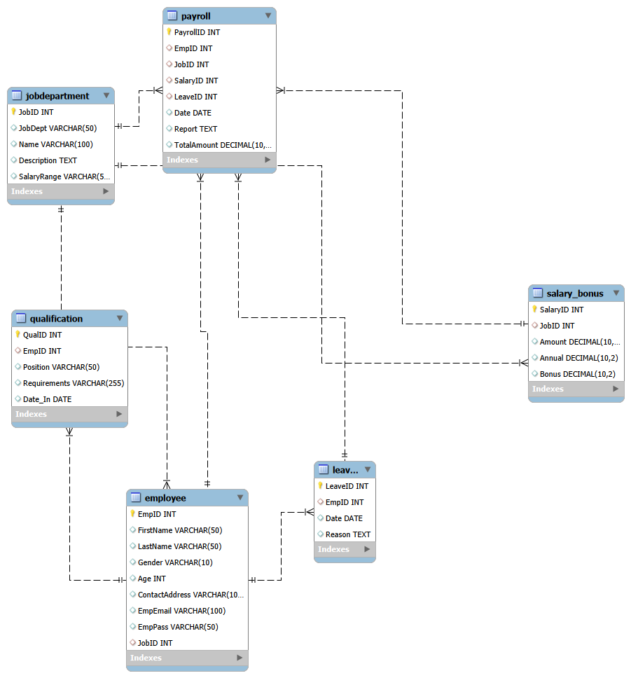

# Employee-Management-System-Using-SQL

This project showcases how SQL can be used to design and manage a complete Employee Management System (EMS).  
The goal is to build a structured relational database that helps track and manage employees, departments, salaries, bonuses, leaves, qualifications, and payroll efficiently.

---

## 🚀 Project Objectives

The primary objective of this project is to use SQL to design a well-structured database that helps organizations manage employee-related information.  
Key objectives of this project are:

- **Organize Employee Information:** Store and manage details of all employees.
- **Department & Job Role Management:** Maintain department-level structure and job descriptions.
- **Salary & Bonus Management:** Track employee salaries, bonus amounts, increments, and distributions.
- **Leave Tracking:** Maintain employee leave records and reasons.
- **Qualification Mapping:** Track education and qualifications of employees.
- **Payroll Generation:** Generate payroll information integrating salary, bonus, and leave deductions.
- **Provide Insights:** Extract useful insights using SQL queries to support HR decision-making.

---

## 🗂 Database Schema Overview

The Employee Management System is built on a relational database consisting of the following tables:

- **employee** – Stores core employee details such as name, contact, gender, age, job role, and login credentials.  
- **jobdepartment** – Contains all department and job role details.  
- **salary_bonus** – Tracks salary bonuses, annual increments, and allowance information.  
- **qualification** – Stores academic qualifications and competencies of employees.  
- **leave** – Maintains employee leave history.  
- **payroll** – Generates payroll combining salary, bonus, and leave deductions.

---

## 🖼 ER Diagram

This diagram represents the complete structure of the database:



---

## 📊 Analysis and Queries

This project includes several SQL queries designed to extract key business insights.  
The analysis is divided into major HR-related areas:

---

### 👥 Employee Insights

- **Top-Earning Employees:** Identify employees drawing the highest combined salary + bonus.  
- **Employee Leave Frequency:** Track which employees take the most leaves.  
- **Qualification-Based Filtering:** Identify employees with specific academic qualifications.  
- **Department-Based Distribution:** Understand the headcount per department.  

---

### 💰 Salary & Bonus Insights

- **Highest Bonuses:** Identify employees who received the highest bonus amounts.  
- **Annual Increment Tracking:** Track year-over-year salary growth.  
- **Salary Range Comparison:** Identify job roles with highest vs lowest pay.  

---

### 📅 Leave Management Insights

- **Frequent Leave Takers:** Employees with the highest leave counts.  
- **Leave Trends:** Monthly and annual leave pattern analysis.  
- **Department-wise Leave Distribution:** Which departments take more leaves.  

---

### 🏢 Department Insights

- **Most Populated Departments:** Departments with maximum employees.  
- **Job Role Trends:** Roles associated with higher salaries/bonuses.  
- **Department-to-Payroll Ratio:** Evaluate cost and contribution of each department.  

---

### 📑 Payroll Insights

- **Total Salary Paid:** Compute total payroll disbursement.  
- **Payroll After Deductions:** Salary after leave deductions & bonuses.  
- **Bonus & Incentive Analysis:** Evaluate contribution of bonuses to payroll.  

---

## ⭐ Key Insights & Recommendations

### 1️⃣ Optimize Bonus Distribution  
Some departments receive disproportionate bonuses; optimizing can improve fairness.

### 2️⃣ Reduce Leave Abuse  
Certain employees take excessive leaves — consider wellness policies.

### 3️⃣ Promote High-Qualified Talent  
Highly qualified employees often perform better; invest in upskilling.

### 4️⃣ Improve Departmental Balance  
Headcount is uneven across departments — strategic hiring recommended.

### 5️⃣ Salary Structure Improvement  
Salary variance within same roles suggests restructuring.

---

## 🛠 Technologies Used

- MySQL  
- MySQL Workbench  
- ER Diagram Modeling  
- Git & GitHub  

---

## 🗂 Folder Structure

```
sql/
 ├── sql_workbench_Sourav_Varma_G.sql     # Full SQL script
 └── assets/
       ├── ERDiagram.png                  # ER Diagram
       └── placeholder.txt                # placeholder file (remove if empty)

sql_ppt_Sourav_Varma_G.pptx               # Presentation
README.md                                  # Documentation
```

---

## ▶️ How to Run This Project

1. Download or clone the repository.  
2. Open **MySQL Workbench**.  
3. Run the SQL script:

```
sql/sql_workbench_Sourav_Varma_G.sql
```

4. Refresh schemas.  
5. Open the ER diagram:

```
sql/assets/ERDiagram.png
```

6. Use the PPT file for a visual explanation.

---

## 🧠 Challenges Faced

### 🔹 Complex Schema Design  
Ensuring proper foreign key relationships across all tables.

### 🔹 Multi-Table Joins  
Payroll, salary, and leave operations required nested JOIN queries.

### 🔹 Data Normalization  
Reducing redundancy while maintaining clarity.

### 🔹 Integrating Leave → Payroll  
Mapping leave deductions into payroll computations.

---

## 📘 SQL Concepts Covered

- Primary keys & foreign keys  
- Joins (INNER, LEFT, RIGHT)  
- GROUP BY & HAVING  
- Subqueries  
- Aggregate functions  
- Constraints  
- Views  
- ER Modeling  
- Data normalization  

---

## 📝 Conclusion

This project demonstrates the power of SQL in designing a complete Employee Management System for real-world HR operations.  
By analyzing employee behavior, compensation structures, departmental trends, and leave patterns, organizations can make informed decisions regarding:

- Workforce planning  
- Salary optimization  
- Performance evaluation  
- Leave policies  
- Payroll management

## 📁 Folder Structure


